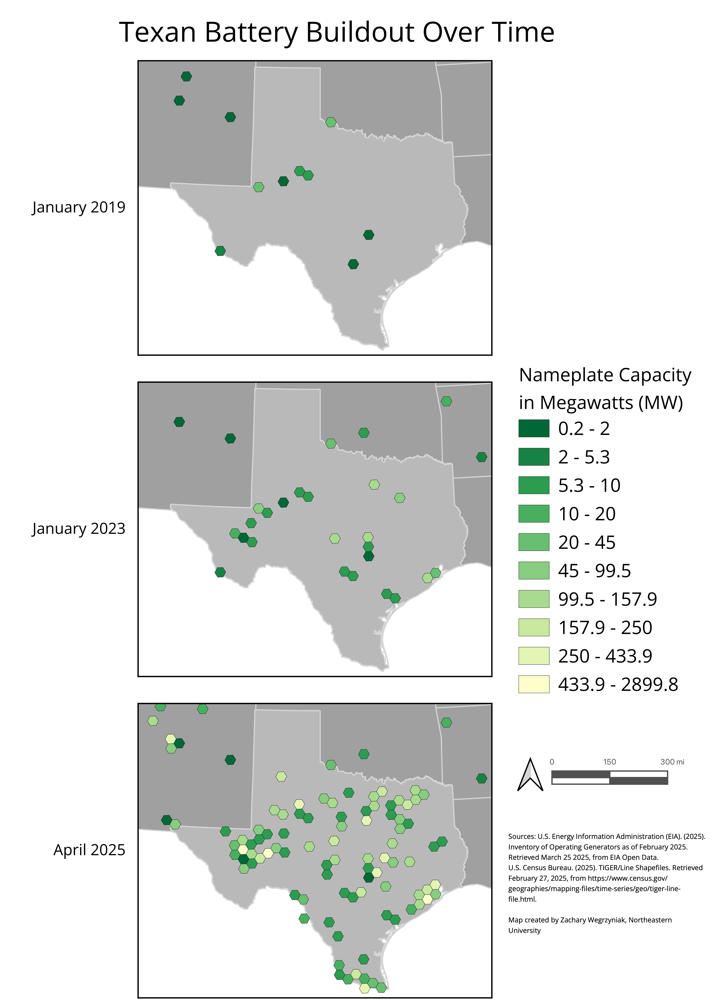
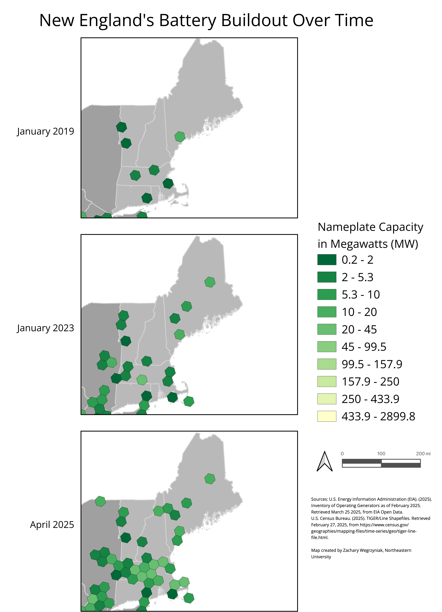
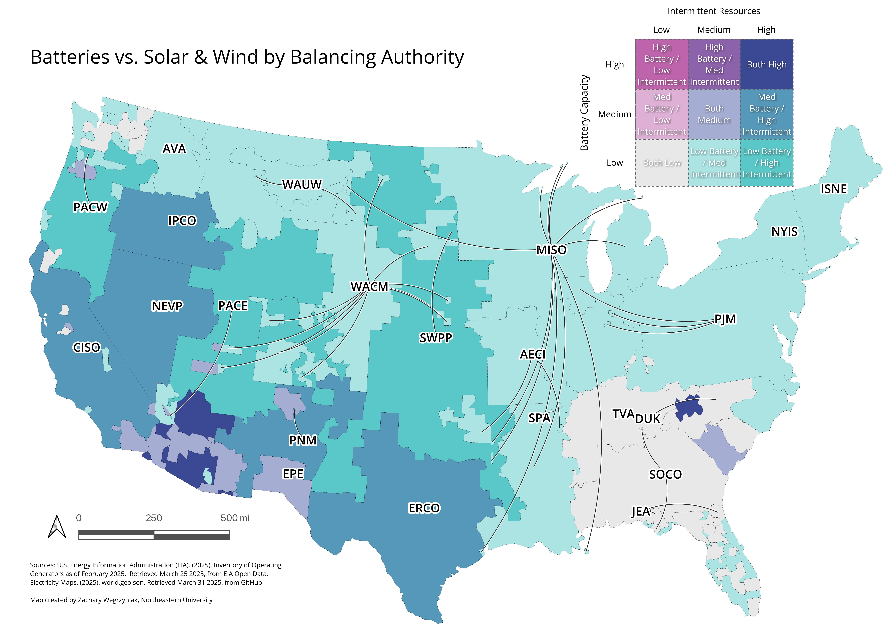

# Northeastern University PPUA 5263 Final Project

## Methodology

### What did you do? And with what datasets?

Using the [EIA 860M Dataset from February 2025](https://www.eia.gov/electricity/data/eia860m/), I charted the distribution of battery and other generator types in the continental US. Specifically, I took the "Current", "Planned", and "Retired" generators sheets out of that document with an R script. For the distribution of generators by balancing authority region, I used [Electricity Maps' world.geojson](https://github.com/electricitymaps/electricitymaps-contrib/blob/f4c2fab36ade2746f093479e160926333ae26d0f/web/geo/world.geojson). I'd tried using the EIA published balancing authority shapefile directly, but due to overlapping regions, opted for the simpler Electricity Maps' version.

### How did you do it?

#### Layers

I'd originally wanted to try a size graduated map where each generator type was categorized by color, and the capacity of each generator was the size of the symbol. At the national level, this was extremely dense information though. Generators categorized as batteries were ~800 instances and they tended to be densely stacked together. After a Saturday playing _Sid Meyer's Civilization VII_, I opted instead for hex binning of generators by their generator type instead.

Hex binning presented its own issues, namely, how big should I make the grid items to avoid MAUP? I used QGIS, and the Summarize by Location Tool. And I started by doing just batteries and then I wanted to roll that same process out to other generator types and their `Status`. Each time I changed the size of the grid elements, I'd have to go through by hand and do everything again...We had a lecture in class though where Dr. Fang showed off copying a tool command as a Python script, and I ended up digging into the Python QGIS, pyqgis, API.

The pyqgis docs were fairly rough, but my flow was largely, try getting Claude (AI) or Deepseek (AI) to generate code based on the initial QGIS tool command, and then try looping based on the generator type, status, and operating year. When the AI generated code didn't work outright (more or less always), or it caused ownership bugs (i.e. two layers can't own the same graduated scale) that caused crashes after running, it usually boiled down to the version of QGIS I was using 3.40, the LTS, and I'd have to look through the API to try and sort things out.

Another problem I ran into was the original scripts had operated on the assumption that I wanted a shapefile for each combination of features, which rapidly became impractical. With _8 generator types \* 4 status types = 32_ _layers_ and _8 years \* 8 generator types = 64 layers_, my script rapidly became unusably slow, taking something like 20 minutes to run. I ended up getting past that hurdle with a script that generated layers for each generator type in a gpkg after Deepseek suggested it (with non-functional code, of course). Writing to all those layers to a gpkg was an order of magnitude faster, bringing run time down significantly.

#### Temporal and Bivariate Analysis

Based on my initial run throughs with the data (and scripting) and the class lecture on time series data, I ended up with a flow where I wanted to animate the hex binning of battery capacity over time. After some scripting false starts with Deepseek, the basic flow I patched up was "take the time since a generator opened or is planned to open until their planned retirement date" and bin those intervals monthly over time. I sanity checked the script output based on Idaho Power's battery rollout, which I'd heard about from press releases and my parents (who live by one of the battery generators).

For bivariate analysis, I lowered the map resolution to balancing authorities. For this portion, I used QGIS virtual table feature to aggregate the EIA 860M data by capacity for each respective balancing authority. I included total capacity for each balancing authority as well as total battery, intermittent generators (wind/solar), and hydro power. Then I did three levels of classification for batteries and intermittent generators before charting the two against each other.

### Include a discussion of the scale and accuracy of your data sets and how that affected your project

Other than a few fat-fingered latitude and longitude coordinates---one New York generator in Ontario, Canada, a few latitudes above \>90, the [EIA 860M data](https://www.eia.gov/electricity/data/eia860m/) seems relatively clean. The EIA did publish a notice correcting the February 2025 dataset used for these maps after I'd finalized my layouts.

I did run into some relatively subtle scripting bugs. One was how I'd handled reading floating point values out of the generators to do time series analysis. If the generator was less than 1, it would get rounded to zero and result in that bin not appearing in the map. I noticed my mistake by checking the temporal data over time against the underlying generator points layer.

### Limitations: What are the limitations of your dataset?

The biggest limitation of the data is how predictive future data is. For BESS generators that are planned to be up and running within the next couple of years, the trade war might significantly alter the economic viability of the projects. Something like 70% of BESS used in the US is made in China ([Bloomberg, 2025](https://www.bloomberg.com/news/newsletters/2025-04-03/how-trade-wars-impact-the-green-transition-what-we-know-so-far)).

## Results and Visualizations

### Maps

<figure>
  
  <figcaption>Figure 1: Texas Battery Capacity (2019-2025). In 2019, Texas started with a smattering of batteries mostly around Midland. By 2023, after the January 2021 winter storm, Houston, Austin, and Dallas-Fort Worth all had significant storage nearby. By 2025, Texas is on track to have more battery capacity than California.</figcaption>
</figure>

<figure>
  
  <figcaption>Figure 2: New England Battery Capacity (2019-2025). In 2019, New England had relatively few areas with battery capacity, with a plurality in Massachusetts and the highest capacity grid cell in Maine. By 2023, capacity spread to Nantucket, and by 2025, it extended into New Hampshire with Massachusetts mostly covered. Overall, New England has significantly less battery storage relative to total grid capacity than California or Texas.</figcaption>
</figure>

<figure>
  
  <figcaption>Figure 3: California Battery Capacity (2019-2025). California led early with the quickest battery buildout. By 2023, a band of capacity developed running from the Arizona border up to the Bay Area, with a stronger tendency for capacity concentration in the southern part of the state.</figcaption>
</figure>

<figure>
  
  <figcaption>Figure 4: Bivariate Analysis of Intermittent Generators vs BESS. This map shows that Midwestern and Inner Mountain West balancing authorities might benefit most from additional battery capacity. The Southwest Power Pool (SWPP) is a notable member of this group. The analysis demonstrates that battery adoption and intermittent renewable adoption aren't necessarily correlated, with different regional approaches emerging based on local conditions and policies.</figcaption>
</figure>

### Video Animation

<video width="640" height="480" controls>
  <source src="./media/temporal_animation.mp4" type="video/mp4">
  Your browser does not support the video tag.
</video>
